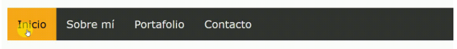

# Menú Horizontal 

Se muestra en pantalla un menú de forma horizontal y tiene las siguientes funciones:
- Cambia de color de fondo (de negro a un tono de amarillo).
- Cambia de color de letra (de blanco a negro).

Empleamos la pseudo-clase `:hover` para darle este efecto cuando el puntero pasa sobre cada elemento.

Este menú puede ser estático, es decir queda en la parte superior de la pantalla o puede se dinámico que a medida que baje el curso este se mueva con el mismo.

